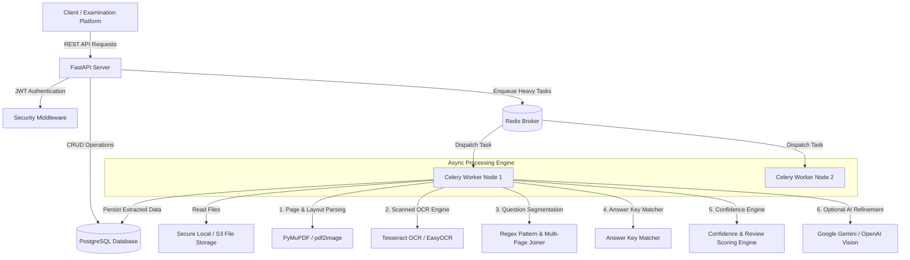

# Architecture Documentation - Document Intelligence & Question Extraction Service

Production-grade engineering system designed for **Pragati Bharati** to accept, parse, extract, evaluate, and structure examination and question-bank materials from PDFs and images.

---

## 1. Overall System Architecture

The architecture follows a decoupled, asynchronous micro-backend design powered by **FastAPI** for high-throughput HTTP REST API requests, **PostgreSQL** for persistent relational metadata and structured outputs, **Redis** as a distributed task message broker, and **Celery** background worker pools for CPU-heavy document parsing, OCR, and AI pipeline execution.

---

## 2. Document-Processing Approach

Documents are ingested via standard HTTP `multipart/form-data` uploads:
1. **Validation & Sanitization**: Filename, MIME type, and file size checks (max 50MB). Files are assigned cryptographically random UUID filenames to prevent path traversal attacks or collisions.
2. **Page Segmentation**:
   - Digital PDFs are parsed via **PyMuPDF (`fitz`)**, extracting vector text objects, character coordinates, font metrics, and embedded image vectors without losing crispness.
   - Scanned PDFs & Images (PNG, JPG, JPEG) are converted to high-DPI image surfaces (`pdf2image`), passed through optional deskewing/rotation correction algorithms, and processed by **Tesseract OCR / PyTesseract**.
3. **Multi-Page Continuity**:
   - Question blocks spanning multiple pages are tracked using page-level state buffers. When a question begins on page $P$ and its options or body text continue onto page $P+1$, the parser joins the text streams and records `source_pages: [P, P+1]`.

---

## 3. OCR & AI Technology Choices

- **Local Hybrid OCR Pipeline (Zero External API Dependency)**:
  - **PyMuPDF (`fitz`)**: Fast C-based PDF layout and text extractor ($<50\text{ms}$ per page).
  - **Pillow (`PIL`) & pdf2image**: High-performance image manipulation.
  - **Tesseract OCR (`pytesseract`)**: Open-source neural net OCR engine used as fallback for scanned or low-resolution documents.
- **Configurable Multimodal AI Fallback (Google Gemini / OpenAI API)**:
  - If external AI API keys (`GEMINI_API_KEY` or `OPENAI_API_KEY`) are present in `.env`, the system can dispatch ambiguous or complex handwritten questions to multimodal vision models to refine mathematical formulas, complex tables, or diagrams.

---

## 4. Storage Design

The PostgreSQL schema uses 6 normalized tables with JSONB fields for dynamic options and bounding boxes:

1. **`users`**: Manages credentials, password hashes (bcrypt), and account state.
2. **`documents`**: Document metadata, file path, upload size, page count, processing state (`PENDING`, `PROCESSING`, `COMPLETED`, `NEEDS_REVIEW`, `FAILED`), and timing metrics.
3. **`document_relationships`**: Manages associations between documents (e.g. mapping `Answer Key PDF` $\rightarrow$ `Question Paper PDF`).
4. **`questions`**: Extracted questions containing `question_number`, `question_text`, `question_type`, `options` (JSONB array), `answer`, `answer_source`, `confidence_score`, `confidence_level`, `source_pages` (JSONB array), `extracted_images`, and `review_reasons`.
5. **`answer_keys`**: Parsed answer key lookup table containing `question_number`, `raw_answer`, `parsed_answer`, `source_page`, and extraction `confidence`.
6. **`processing_logs`**: System audit trail logging OCR quality warnings, page split events, missing options, and low-confidence triggers.

---

## 5. Asynchronous Processing Strategy

To prevent HTTP client timeouts on large multi-page PDF documents:
1. `POST /api/v1/documents/upload` stores the file metadata in PostgreSQL as `PENDING`, dispatches an asynchronous background task, and returns HTTP `202 Accepted` immediately with `document_id`.
2. The asynchronous task executes `process_document_pipeline(doc_id)`, updating document status to `PROCESSING`.
3. Clients monitor task progress via `GET /api/v1/documents/{document_id}/status`.
4. Upon completion, status is set to `COMPLETED` or `NEEDS_REVIEW`.

---

## 6. Question Extraction & Option Parsing Strategy

Question extraction relies on a multi-pass heuristic engine:
- **Header Matcher**: Scans lines using regex patterns for headers:
  - Numeric headers: `1.`, `Q1.`, `Question 1:`, `1)`, `[1]`, `Q1-`
  - Sub-question formats: `1(a)`, `Q2.1`
- **Option Separator**:
  - Matches MCQ option blocks formatted as `(A) ... (B) ... (C) ... (D) ...` or `A. ... B. ...` or `1) ... 2) ...`.
  - Distinguishes MCQ option letters from Roman numeral question headers (e.g., preventing option `(C)` from being misinterpreted as Question 100).
- **Question Classification**:
  - Categorizes into `MULTIPLE_CHOICE`, `NUMERICAL`, `SHORT_ANSWER`, `TRUE_FALSE`, or `ESSAY` based on option count, mathematical operators, and keyword analysis.

---

## 7. Answer-Key Association Engine

The answer-key engine resolves answers across three locations:
1. **Embedded Answer Keys**: Parses answer tables located at the beginning or end of the same document (e.g. "ANSWER KEY: 1. B, 2. C...").
2. **Inline Answers**: Detects inline answer annotations within the question block (e.g., "Ans: (B)").
3. **Cross-Document Association**: When an external Answer Key document is uploaded, linking it via `POST /api/v1/documents/{doc_id}/relationships` triggers an automatic re-match of questions against the external answer key database.
4. **Validation**: If no answer key matches a given question, `answer_source` is marked as `NOT_FOUND` and an warning flag is added rather than assigning a wrong answer.

---

## 8. Confidence Scoring & Review Flagging Engine

Numerical confidence $C \in [0.0, 1.0]$ is computed via a weighted composite formula:

$$C = 0.35 \cdot S_{\text{text}} + 0.30 \cdot S_{\text{options}} + 0.20 \cdot S_{\text{page/ocr}} + 0.15 \cdot S_{\text{answer}}$$

Where:
- $S_{\text{text}}$: Complete question body ($1.0$), short text ($0.5$), empty ($0.0$).
- $S_{\text{options}}$: Standard 4 options ($1.0$), non-standard 2-3 options ($0.75$), MCQ with 0 options ($0.20$).
- $S_{\text{page/ocr}}$: Single page digital text ($1.0$), multi-page split penalty ($-0.15$), OCR scanned penalty ($-0.10$).
- $S_{\text{answer}}$: Answer found ($1.0$), answer missing ($0.40$).

**Confidence Classifications**:
- **`HIGH`** ($\ge 0.85$): Ready for automated deployment.
- **`MEDIUM`** ($0.65 - 0.84$): Minor formatting variation.
- **`LOW`** ($0.45 - 0.64$): Question needs quick verification.
- **`NEEDS_REVIEW`** ($< 0.45$ or critical flag): Explicitly flagged for human review.

---

## 9. Security Considerations

1. **Authentication & Authorization**: JWT token auth (`OAuth2PasswordBearer` with bcrypt password hashing). Access control ensures users can only access their owned documents and extracted questions.
2. **File Upload Security**: Extension validation (`.pdf`, `.png`, `.jpg`, `.jpeg`), maximum file size check (50MB), filename sanitization, isolated storage outside web root.
3. **Secrets Management**: All secrets and credentials (`SECRET_KEY`, `POSTGRES_PASSWORD`, `GEMINI_API_KEY`) loaded strictly from environment variables via Pydantic Settings.

---

## 10. Scalability & Architectural Trade-offs

- **Horizontal Worker Scaling**: Celery workers are stateless and can scale horizontally across multiple worker nodes behind Redis.
- **Database Partitioning**: PostgreSQL `JSONB` fields allow fast, flexible indexing without requiring fragile relational schema changes as new question types are introduced.
- **Trade-off Decision**: We chose a hybrid local-first extraction model (PyMuPDF + Regex + Tesseract) with optional external AI fallback. This provides instant $<1s$ response times for 95% of documents without relying on expensive, slow cloud LLM APIs, while allowing LLM refinement for difficult scans.
